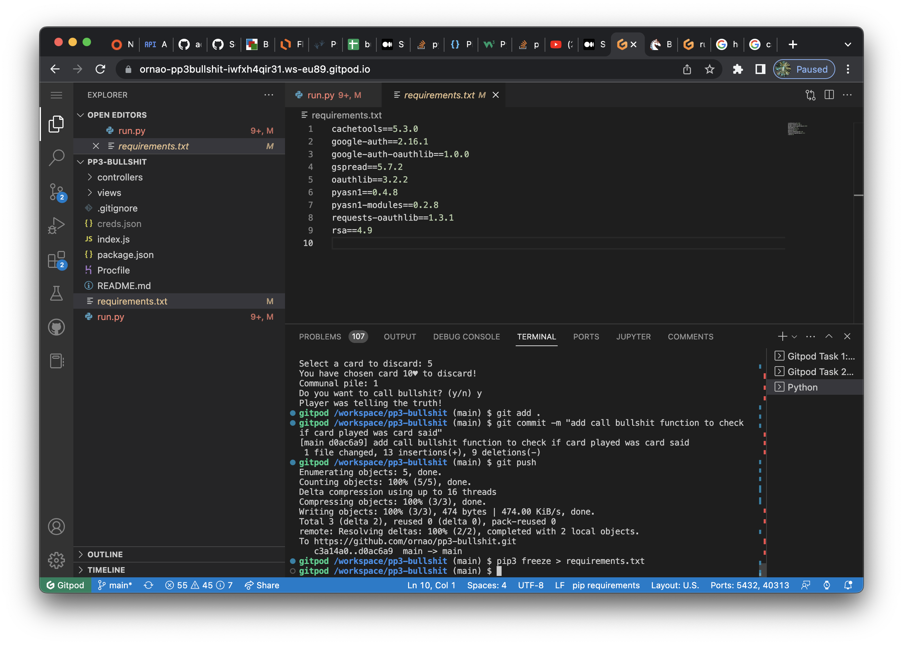
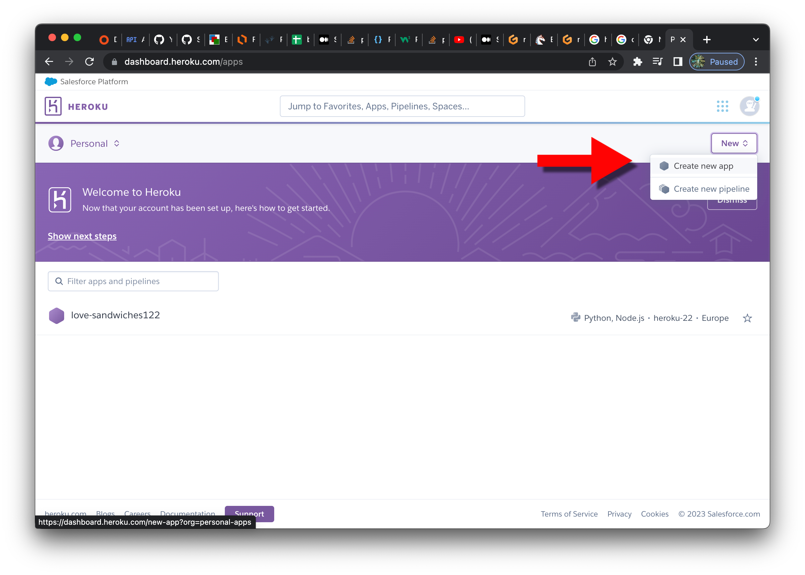
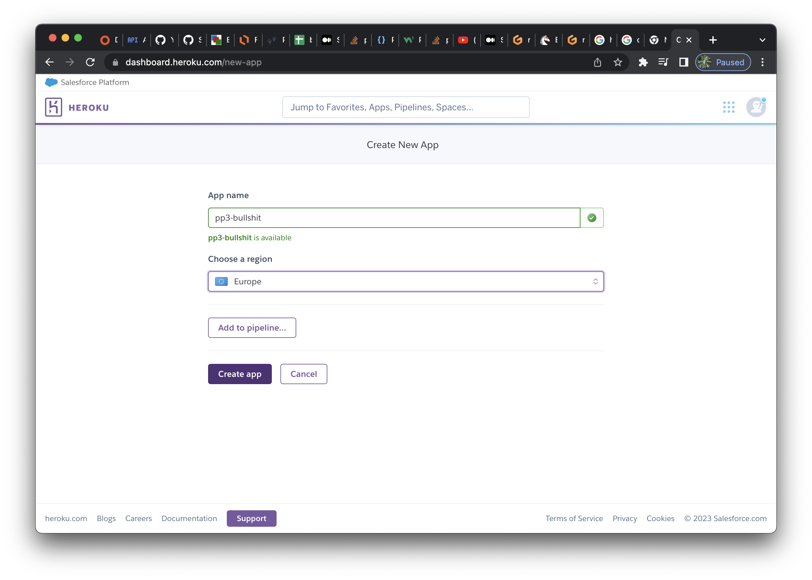
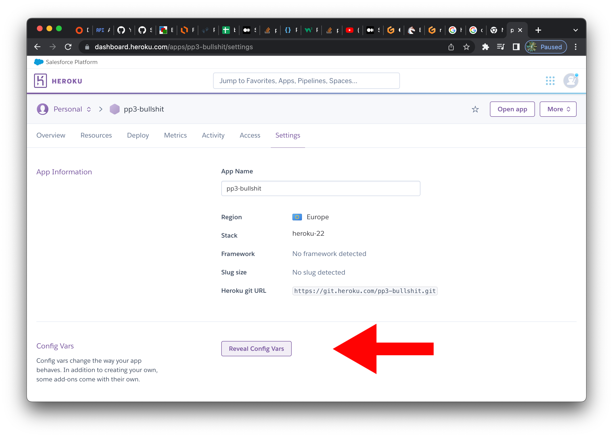
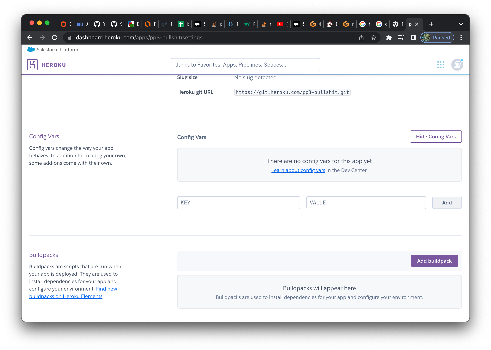
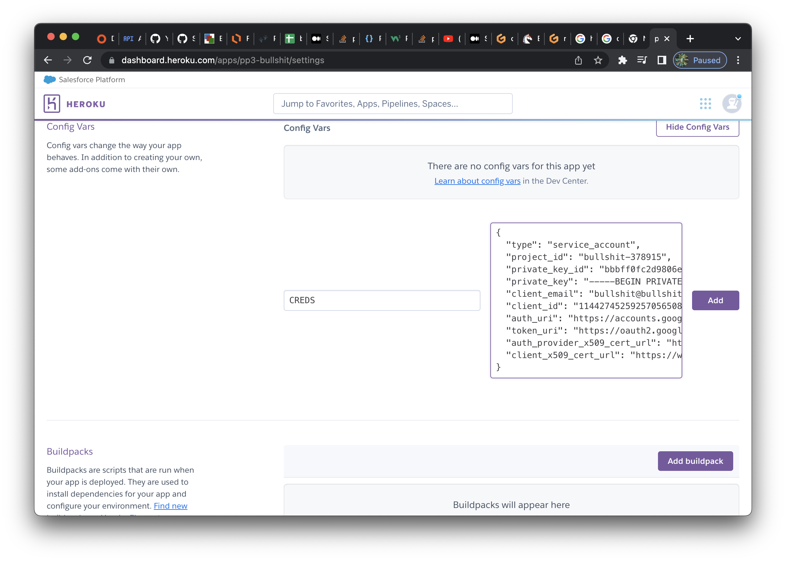
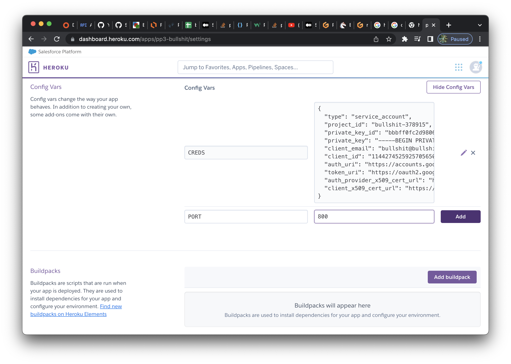
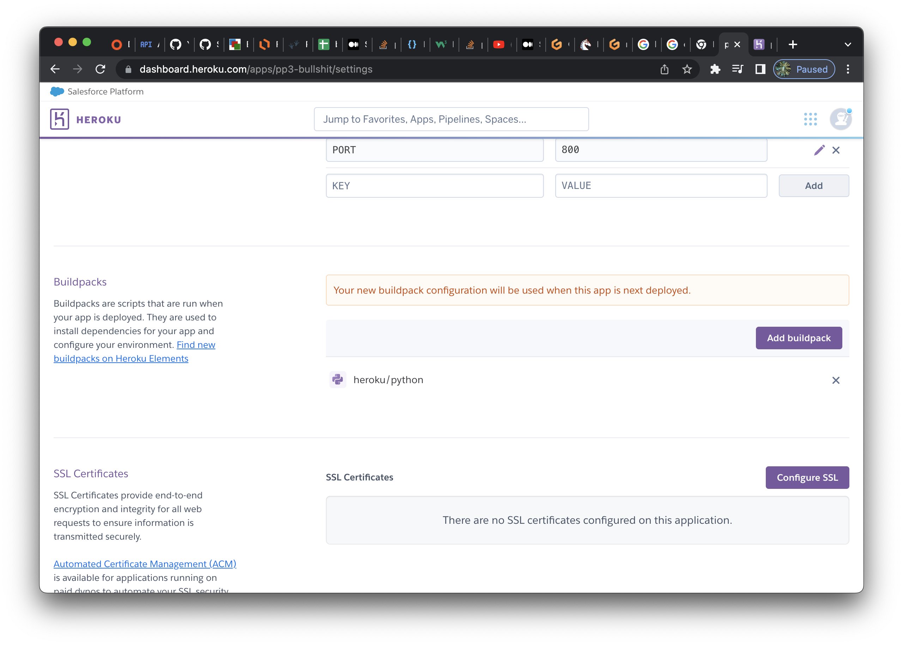
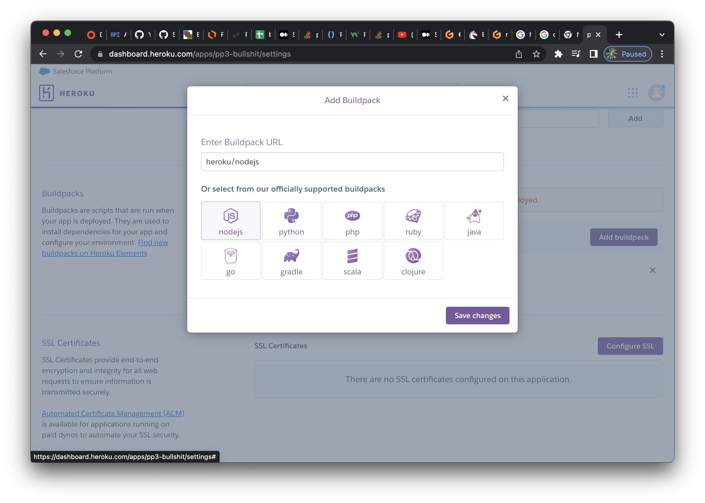
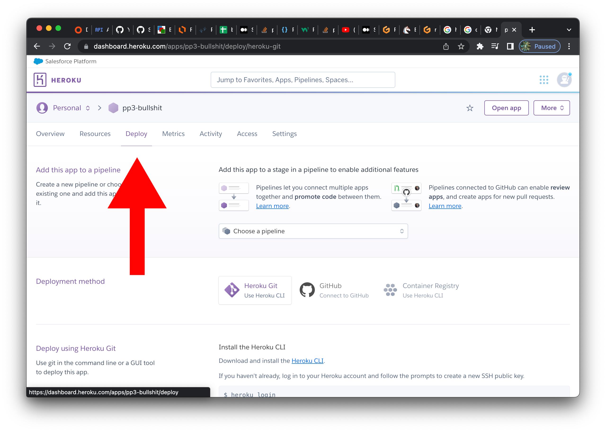

**Developer: Orna Reynolds**

💻 [Visit live website](https://pp3-bullshit.herokuapp.com/)

## About

This is a command-line version of the bluff card game Bullshit for 3 players. Many versions of this game exist and the classic game is best played in a group of people. 

The classic game generally is played with relatively no rules, all cards in deck and players can discard cards to communal pile in any order with any amount of matching cards. My game is played where the user can only discard one card at a time and only one suit in deck is used. 

The objective of the game is to be the first one to get rid of all your cards. 

## Table of Contents
  - [Project Goals](#project-goals)
    - [User Goals](#user-goals)
    - [Site Owner Goals](#site-owner-goals)
  - [User Experience](#user-experience)
    - [Target Audience](#target-audience)
    - [User Stories](#user-stories)
      - [Users](#users)
      - [Site Owner](#site-owner)
  - [Technical Design](#technical-design)
    - [Flowchart](#flowchart)
  - [Technologies Used](#technologies-used)
    - [Languages](#languages)
    - [Frameworks & Tools](#frameworks--tools)
    - [Libraries](#libraries)
  - [Features](#features)
  - [Validation](#validation)
  - [Testing](#testing)
    - [Manual Testing](#manual-testing)
  - [Bugs](#bugs)
  - [Deployment](#deployment)
  - [Credits](#credits)
  - [Acknowledgements](#acknowledgements)

## Project Goals

### User Goals

- Enjoy a fun and straightforward card game 
- Have the option to view over the rules of the game or play game straightaway. 
- Possiblility log into an existing account that keeps track of results.

### Site Owner Goals

- Build a game that is simple and straightforward to use.
- Make sure players understand the goal of the game and how to achieve that 
- Design a game that asks for user input, validates and manipulates it and also providesnfeedback to players while they play

## User Experience

### Target Audience

Those of all ages who enjoy card games and more specifically card bluffing games. 

### User Stories

### Users
1. I want the name of the game clearly displayed and have an idea how to play it from first look.
2. I want to be asked if I want to start the game or read the rules first
3. I want to be able to start the game after I have read the rules of the game
4. I would like the cards in my hand to display as a graphic picture and for them to update when I play a card
5. I want to receive feedback from the game about the my inputs and have the opportunity ti input them again if I am wrong.
6. I want the option to play again once the game is over 
7. If I play the game multiple times, I want how many times I have won to be saved
8. I want to enter my name at start of game to personalise it 
9. I want the communal cards pile displayed so I know how many cards the next loser of the round could get 

### Site Owner
10. I want the back of the computer's cards to display as a graphic and for them to update when hand is updated. Seeing the front of the cards would ruin the game for the user because they would know if the computer was lying
11. I want the user to have the option to play the game again without having to exit. This is to enhance user experience.
12. I want the user's name and how many times they have won to be saved to google sheets.
13. I want user inputs to undergo extensive validation so game execution is not affected. 
 

[Back to Table Of Contents](#table-of-contents)

## Technical Design

### Flowchart

## Technologies Used

### Languages

- Python

### Frameworks & Tools

- Git was used for version control
- [GitHub](https://github.com/) was used as a remote repository to store project code
- [Google Sheets](https://www.google.co.uk/sheets/about/) were used to store player usernames

### Libraries

#### Python Libraries

- os - used to add a seperate line to terminal underneath text
- random - used to shuffle deck, control computer choices of card selection and calling bullshit
- sys & sleep - used to create a typing effect within the games rules

#### Third Party Libraries

- [colorama](https://pypi.org/project/colorama/) - used this library to add color to the terminal to differenciate players
- gspread - used to add and manipulate data in my Google spreadsheet and to interact with Google APIs

[Back to Table Of Contents](#table-of-contents)

## Features

### Title screen 

- Provides name of game in pleasant graphic
- Gives short description of game to user has idea of what game is about immediately
- User stories covered:
 

    
Screenshot

### Menu
- Gives user option to play the game or read the rules first
- User stories covered: 
  

    
Screenshot

  

### Game rules
- Displays clear game rules
- Allows user to start game once they are ready
- User stories covered: 
  

    
Screenshot

  

### Cards display
- Displays all players cards
- Shows user their number cards
- Hides other player cards from user seeing type
- User stories covered: 
  

    
Screenshot

  

### Name prompt
- Ask user their name
- Relay back to user at various points throughout the games
- User stories covered: 
  

    
Screenshot

  

### Communal cards pile counter
- Counts number of cards user discarded in to pile
- Pile increases or decreases as game is played
- User stories covered: 
  

    
Screenshot

  

### Play again
- Gives user option to restart game whether they win or lose
- User stories covered: 
  

    
Screenshot

  

[Back to Table Of Contents](#table-of-contents)

## Validation

## Testing

### Manual Testing

#### Users stories
1. I want the name of the game clearly displayed and have an idea how to play it from first look.

| **Feature**   | **Action**                    | **Expected Result**          | **Actual Result** |
| ------------- | ----------------------------- | ---------------------------- | ----------------- |
| Title screen | Press "Run Programme" | Users are greeted with graphic title and short explanation of game | Works as expected |

Screenshot

2. I want to be asked if I want to start the game or read the rules first

| **Feature**   | **Action**                    | **Expected Result**          | **Actual Result** |
| ------------- | ----------------------------- | ---------------------------- | ----------------- |
| Menu | Select 1 | Game begins | Works as expected |
| Menu | Select 2 | User is presented with rules | Works as expected |

Screenshots

  
  
  

3. I want to be able to start the game after I have read the rules of the game

| **Feature**   | **Action**                    | **Expected Result**          | **Actual Result** |
| ------------- | ----------------------------- | ---------------------------- | ----------------- |
| Game Rules | Press enter | Users is prompted to give enter name | Works as expected |

Screenshot

4. I would like the cards in my hand to display as a graphic picture and for them to update when I play a card

| **Feature**   | **Action**                    | **Expected Result**          | **Actual Result** |
| ------------- | ----------------------------- | ---------------------------- | ----------------- |
| Cards display | Play the game | Cards updating when user loses or gains cards | Works as expected |

Screenshot

5. I want to receive feedback from the game about the my inputs and have the opportunity ti input them again if I am wrong.

[See validation section ](#validation)

6. I want the option to play again once the game is over 

| **Feature**   | **Action**                    | **Expected Result**          | **Actual Result** |
| ------------- | ----------------------------- | ---------------------------- | ----------------- |
| Play again | Win or lose game | Congratualations or hard luck message displays along with y/n to play again | Works as expected |

Screenshot

7. If I play the game multiple times, I want how many times I have won to be saved
8. I want to enter my name at start of game to personalise it 

| **Feature**   | **Action**                    | **Expected Result**          | **Actual Result** |
| ------------- | ----------------------------- | ---------------------------- | ----------------- |
| Name prompt | Enter name | Repeats name back to you capitalized | Works as expected |

Screenshot

9. I want the communal cards pile displayed so I know how many cards the next loser of the round could get 

| **Feature**   | **Action**                    | **Expected Result**          | **Actual Result** |
| ------------- | ----------------------------- | ---------------------------- | ----------------- |
| Communal cards pile counter | Players discard cards to communal pile | Number updates dynamically depending on number of cards in pile | Works as expected |

Screenshot

### Site Owner
10. I want the back of the computer's cards to display as a graphic and for them to update when hand is updated. Seeing the front of the cards would ruin the game for the user because they would know if the computer was lying

| **Feature**   | **Action**                    | **Expected Result**          | **Actual Result** |
| ------------- | ----------------------------- | ---------------------------- | ----------------- |
| Cards display | Play the game | Cards updating when computer players lose or gain cards | Works as expected |

Screenshot

12. I want the user's name and how many times they have won to be saved to google sheets.

Screenshot

13. I want user inputs to undergo extensive validation so game execution is not affected. 
[See validation section ](#validation)

[Back to Table Of Contents](#table-of-contents)
## Bugs
| **Bug** | **Fix** |
| ------- | ------- |
| menu_select() bug: This function was not executing its if or else ==1,2 when incorrect value enter first followed by 1 or 2. | Fixed by setting the start_option_selected variable to input() to get the user's input and using this in loop rather than other value. See [commit ea2de49](https://github.com/ornao/pp3-bullshit/commit/ea2de49f39f90ae87ef3a2644ee9e6bde323bb87) for further details. |
| | |
| computer2_card_select(), computer3_card_select() bug: These function were throwing IndexError: list index out of range as computer3_card_chosen = hands[current_player + 2][x - 1] x value randomly chosen 1-4 was not in lower list values | Fixed by setting x to length of hands so list never out of range. See [commit 5d884ac ](https://github.com/ornao/pp3-bullshit/commit/5d884ac0c9d3ff9044129c781843c331a1a54e35) for further details (scroll to bottom of commit, readme file was added to also in this commit). |
| | |
---

## Deployment
1. Update requirements.txt file by using this command in the terminal Pip3 freeze > requirements.txt. This populates this file with necessary dependencies.

Screenshot

2. Login to heroku and navigate to dashboard where have option to creat a new app

Screenshot

3. Choose a unique name and select Europe as destination 

Screenshot

4. Once app is created navigate to settings and press button “reveal config vars”

Screenshot

5. Add creds key and content from creds file as value

Screenshot

6. Add port key and 800 value to to config var also

Screenshot

7. Scroll down and add python build pack and save changes

Screenshot

8. Add node.js build pack also. It is important to make sure python buildpack is added first and hence ontop of node.js buildpack. 

Screenshot

9. Scroll back to top of page and click deploy tab

Screenshot

10. From the deploy methods displayed select GitHub

Screenshot

11. Search for repo name and click connect to link the two up

Screenshot

12. Deploy from branch and follow link to deployed site after it loads

Screenshot

[Back to Table Of Contents](#table-of-contents)

## Credits

### Images

### Code

## Acknowledgements
